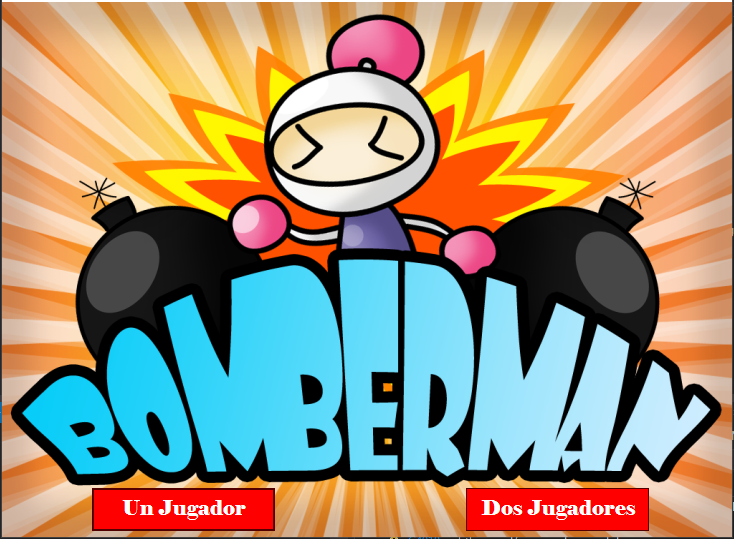
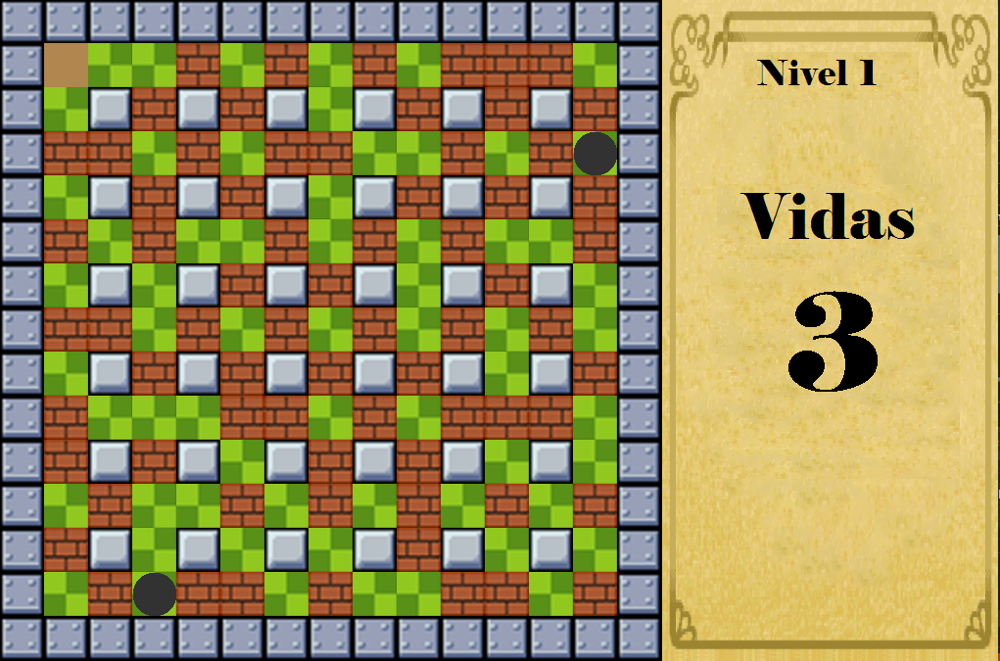
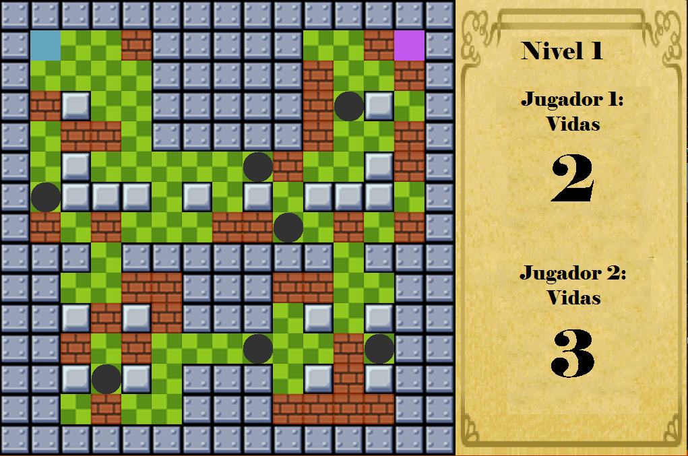

# Bomberman UPC
#### Bomberman game made as final project for algorithms and data structure class CC68 at UPC. Developed by @enzoftware, @daztery and @RodrigoAGM using concepts of:

- Queues
- Stacks
- Lists
- Recursive algorithms

---

#### Screenshots:

---

#### Made by <a href = "https://github.com/enzoftware"> @enzoftware </a>, <a href = "https://github.com/RodrigoAGM">@RodrigoAGM </a> and <a href = "https://github.com/daztery">@daztery </a>
